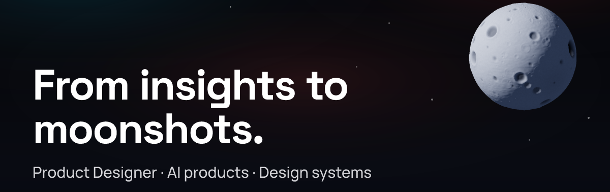
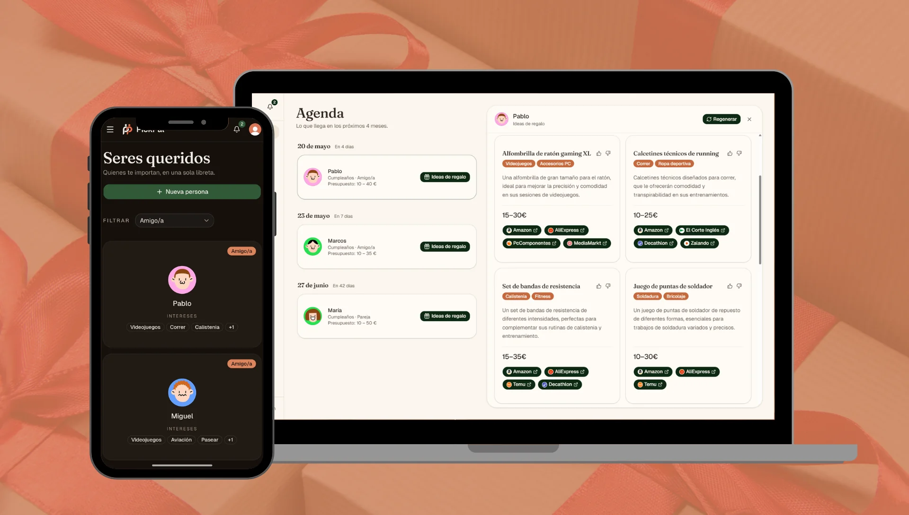
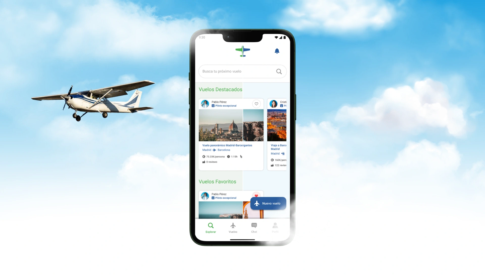

  

---

I help AI-first teams ship AI products their users trust, from field research to adoption.

Today I design **SlothVet**, an AI assistant that turns a veterinary consultation into a clinical record, at Wakyma Innovation, where I am the only product profile on a technical team. I got there through customer support, which is still where a good part of my discovery comes from. The interesting problem, the one I keep choosing, is how a person and a model work together: how someone talks to an assistant, trusts it, catches it when it is wrong, and signs off on what it wrote.

## How I build

I don't write the code.

I make the product, design and architecture decisions, I direct Claude Code to implement them, and I judge what comes back. That is the whole method, and it is not a shortcut: the decisions are the work, and owning them end to end is why a design of mine reaches production looking like the design.

If you want to check rather than take my word for it, the commit history is the record. Around six in ten commits in PickPal carry an AI co-author, and that repository went from first commit to a live private beta in seven days.

## Selected work

<table>
<tr>
<td width="50%" valign="top">

**PickPal** · Reminds you before the date and suggests the gift. My own product, in closed beta.

[Live](https://pickpal.jorgemolinafuster.com) · [Case study](https://jorgemolinafuster.com/work/pickpal) · [Design system](https://www.figma.com/community/file/1680278814366911639) · [Code](https://github.com/jm-fuster/PickPal)

</td>
<td width="50%" valign="top">

**FlySplit** · Cost sharing for non-commercial flights. Master's thesis, highest distinction.

[Case study](https://jorgemolinafuster.com/work/flysplit-flight-sharing) · [Design system](https://www.figma.com/community/file/1677753839261033635)

</td>
</tr>
</table>

Two more design systems live on Figma Community without a written case study: **[Wallapop Meet](https://www.figma.com/community/file/1678855760007300709)**, an unofficial concept not affiliated with Wallapop, and **[World Press Photo App](https://www.figma.com/community/file/1680954998561761879)**, an unofficial student concept.

The banner up there is not a picture of a design. It is rendered at build time from design tokens by **[my portfolio](https://jorgemolinafuster.com)**, with a test suite that re-audits its contrast on every change. I designed that site and built it by directing Claude Code, and it carries a WCAG 2.2 AA self-audit.

## What I actually do all day

**Research.** Discovery interviews inside real clinics, recordings of real appointments, surveys, tree testing, heuristic evaluation, think-aloud tests with SUS. Field research is the part I refuse to delegate.

**Design systems in Figma.** Variables with modes, semantic tokens by alias, component sets with variants and states, tokens exported to code. Four of mine are published on [Figma Community](https://www.figma.com/@jm_fuster), with the files open so you can take them apart.

**Accessibility.** WCAG 2.2 AA is the floor, not the finish line. When contrast and aesthetics disagree, contrast wins.

**Directed builds.** Claude Code and Codex, with the product and architecture calls staying mine.

---

Currently at [Wakyma Innovation](https://wakymavets.com), designing SlothVet. 
Best way to reach me: **jorgemolinafuster@gmail.com**

